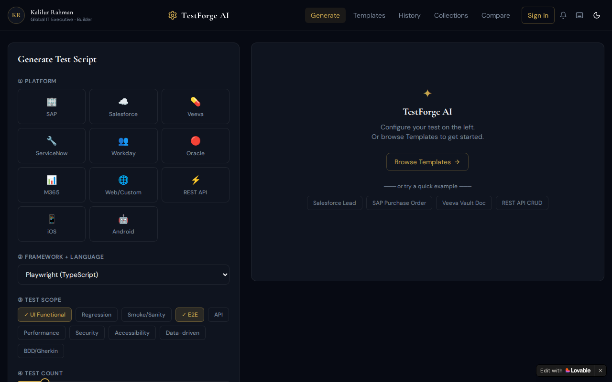
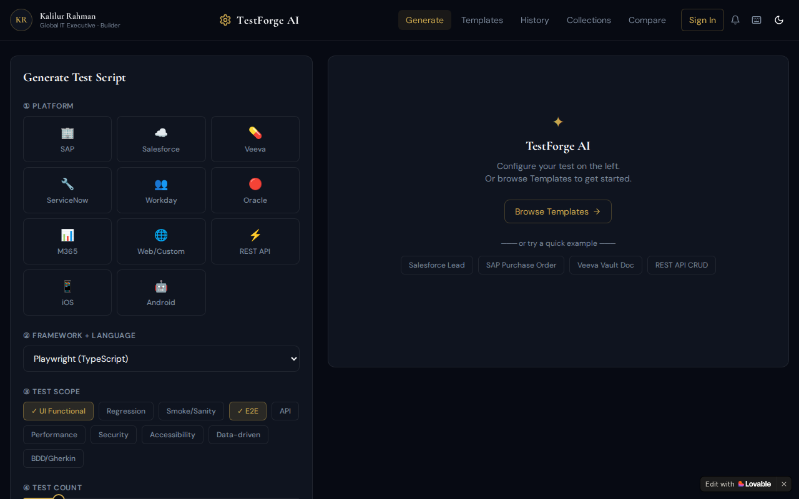
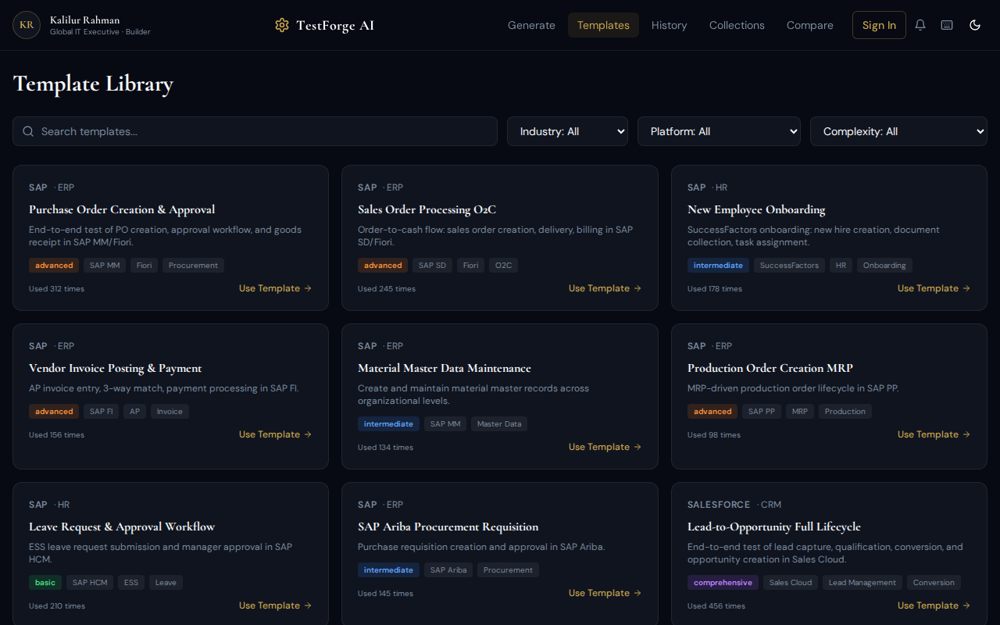
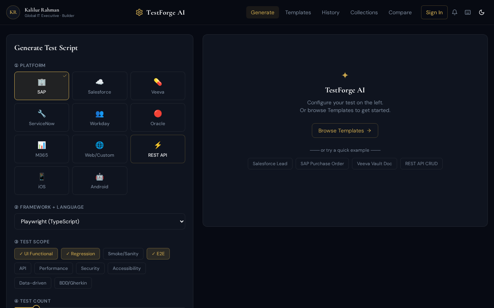
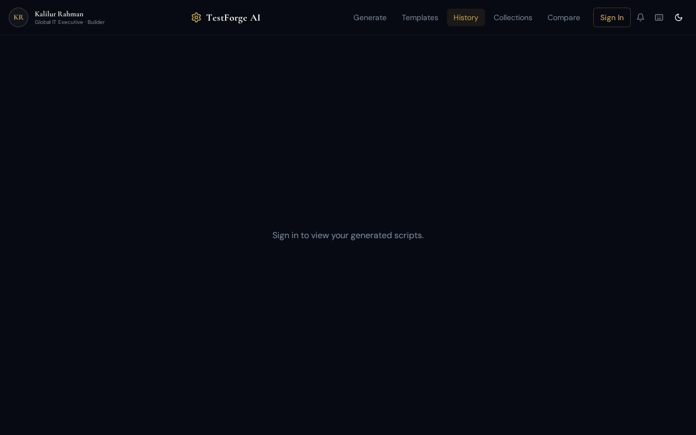
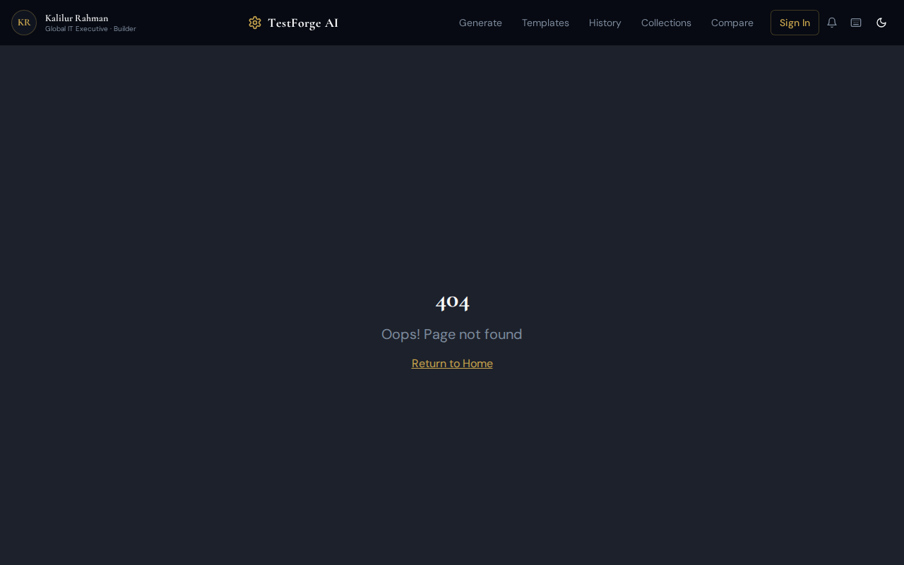

# TestForge AI

**TestForge AI** is an innovative platform tailored for creating, exploring, and saving automated test scripts across various platforms and frameworks. Powered by Generative AI, TestForge provides developers, QA engineers, and IT executives an intuitive interface to rapidly draft test cases for different test scopes.

**Live Application:** [TestForge AI](https://kr-test-automator.lovable.app/)

---

## 🌟 Key Features

### 1. **Script Generation Engine**
The home page lets you configure and generate test scripts seamlessly. Simply select your **Platform**, choose your target **Framework & Language**, and determine the **Test Scope**. The AI engine handles the rest.



#### Supported Configurations
- **Platforms:** SAP, Salesforce, Veeva, ServiceNow, Workday, Oracle, Microsoft 365, Web/Custom, REST API, iOS, Android.
- **Frameworks + Languages:** Playwright (TypeScript), Cypress (JavaScript), Selenium (Java/Python), REST Assured, and more.
- **Test Scopes:** UI Functional, Regression, Smoke/Sanity, E2E, API, Performance, Security, Accessibility, Data-driven.

#### Interactive Selection
Selecting a platform or altering scope actively updates the generation context. See an example below where "SAP" and "Playwright (TypeScript)" are selected:



### 2. **Template Library**
Don't want to start from scratch? The `/templates` page offers a rich library of pre-built scenarios categorized by Industry, Platform, and Complexity.



When you find a scenario that fits your needs (e.g., SAP Purchase Order Creation & Approval), you can effortlessly pull it into your workflow.



### 3. **Script History**
Keep track of all your previously generated tests on the `/history` page. You can easily view details like Platform, Framework, and when it was generated. Star your favorites for quick access!



### 4. **Deprecated Library Route**
The legacy `/library` route has been deprecated. If you attempt to access it, you will receive a 404 Error page. All former library functionality is now consolidated under `/templates` and `/history`.



*(For more details, see the [Library Readme](library/README.md))*

---

## 🛠️ Technology Stack

This project is built using modern web development practices:

- **Frontend:** React, TypeScript, Vite
- **Styling:** Tailwind CSS, shadcn-ui
- **State Management:** Zustand, React Query
- **Routing:** React Router
- **Database / Auth:** Supabase

## 🚀 How to Run Locally

If you want to run or edit this project locally, ensure you have [Node.js & npm](https://github.com/nvm-sh/nvm#installing-and-updating) installed.

```sh
# Step 1: Clone the repository
git clone <YOUR_GIT_URL>

# Step 2: Navigate to the directory
cd <YOUR_PROJECT_NAME>

# Step 3: Install dependencies
npm install

# Step 4: Start the development server
npm run dev
```

## 🤝 Contribution

You can edit files directly via GitHub, use GitHub Codespaces, or utilize your preferred IDE locally. Commit your changes and push to your branch to see them updated.

---

*(Built by Global IT Executive & Builder Kalilur Rahman)*
