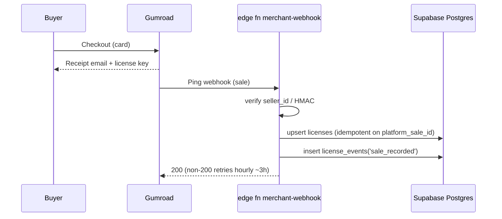
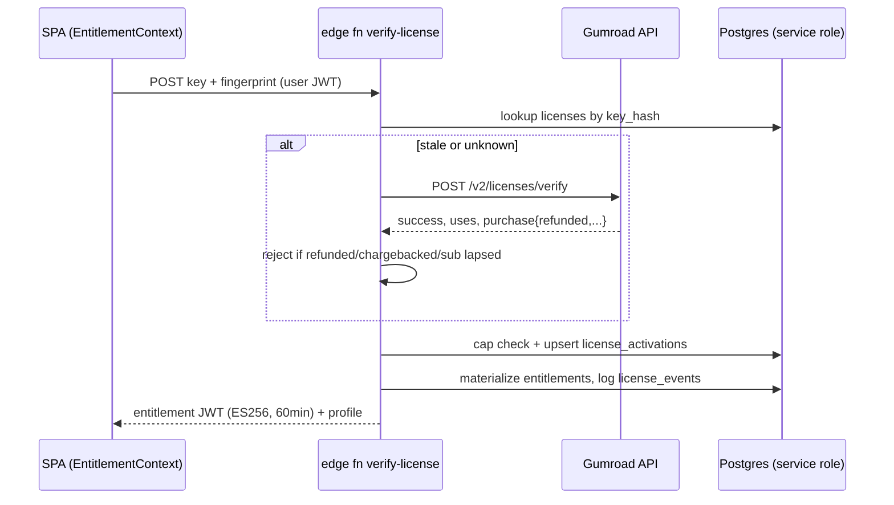
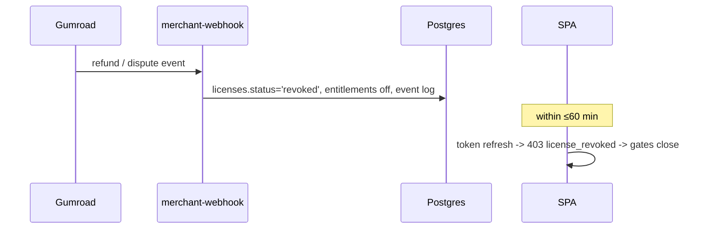

# 02 · License Token Management Architecture

**Stack ground rules this design honors:** the SPA is static Lovable hosting (no middleware — every gate must live in Supabase edge functions or Storage policies); the Supabase anon key is public, so RLS + service-role-only writes are the only DB defenses; `generate-test-script` (`supabase/functions/generate-test-script/index.ts`, `verify_jwt=false` in `supabase/config.toml`) is the existing pattern to extend; premium files currently ship world-readable via `viteStaticCopy` (`vite.config.ts:66-129`) and `public/data`, and are PWA-cached (`vite.config.ts:168-207`); merchant is Gumroad-shaped (verify-only API, Ping webhooks), abstracted so Polar/Lemon Squeezy drop in behind the same tables.

The invariant of the whole design: **the merchant issues keys; Supabase owns entitlements.** Every flow ends with a row in Postgres, and every client-visible privilege is a short-lived signed token derived from those rows — never from the merchant API directly, and never from client state.

---

## 1. End-to-end flows

### (a) Purchase → license key delivery

1. Buyer purchases "SAP Curated Pack" (or bundle) on Gumroad; product has "generate a unique license key per sale" enabled.
2. Gumroad emails the receipt containing the license key (merchant-native delivery — works even if our webhook is down).
3. Gumroad Ping (or a `sale` resource subscription) POSTs to edge function `merchant-webhook`.
4. `merchant-webhook` verifies authenticity (see §3), maps `product_id` → SKU via the `products` table, and upserts a `licenses` row idempotently on `(platform, platform_sale_id)`. Key stored as `key_hash` (SHA-256), last-4 in clear for support lookups.
5. If the buyer's email matches an existing `auth.users` account, a provisional `licenses.claimed_by` hint is recorded; otherwise the row waits unclaimed. A `license_events` row (`type='sale_recorded'`) is written.
6. Nothing is granted yet — activation (flow b) is what binds key → user → entitlement.



### (b) Activation → verification → entitlement → client JWT

Wiring: a new "Activate license" tab in `src/components/auth/AuthModal.tsx` (and a management panel in `src/pages/Profile.tsx`), reachable from a new `/activate` route added to the route table at `src/App.tsx:65-89`. The signed-in requirement is deliberate — keys bind to Supabase accounts so recovery, revocation, and seats all key off `auth.uid()`.

1. Signed-in user pastes key; SPA POSTs `{license_key, device_fingerprint}` to edge function `verify-license` with the **user's session JWT** (`supabase.auth.getSession()`), not the anon key — the exact fix `src/lib/generateScript.ts:39-46` also needs.
2. Function validates the JWT, hashes the key, looks it up in `licenses`.
3. If found locally and `status='active'` and last merchant re-check < 24h old → skip merchant call (cache). Otherwise call Gumroad `POST /v2/licenses/verify` with `product_id` + `license_key`; `increment_uses_count=true` only when this is a *new activation*, `false` for passive re-checks.
4. Inspect the `purchase` object: reject/revoke on `refunded`, `chargebacked`, `subscription_cancelled_at`, `subscription_failed_at` — Gumroad returns `success:true` for refunded sales, so this check is ours alone.
5. Enforce activation cap: count `license_activations` rows; if the fingerprint is new and count ≥ `activation_limit` (default 3), return `activation_limit_reached` with a self-service deactivation list.
6. Upsert `license_activations`, set `licenses.claimed_by = auth.uid()` on first claim (reject if already claimed by another user — support flow required to transfer), materialize `entitlements` rows from the SKU map.
7. Mint an **entitlement token**: ES256-signed JWT (private key in Supabase secrets, public key embedded in the SPA bundle), TTL 60 min, claims `{sub: user_id, lic: license_id, ent: ['sap_v3','bundle_all'], act: activation_id, exp}`.
8. SPA stores it in memory inside a new `EntitlementContext` sibling to `src/contexts/AuthContext.tsx`; every gate (route guard in `App.tsx`, `Index.tsx:197-264 handleGenerate` pre-flight, `useDailyUsage.ts` tier display, `Downloads.tsx` buttons, `TestCaseDetail.tsx` full-row hydration) reads from this context only.



### (c) Re-validation cadence + offline grace

- **Token refresh:** SPA silently re-calls `verify-license` (mode `refresh`, no `increment_uses_count`) when the JWT is within 10 min of expiry. Server re-reads `licenses.status` from Postgres every time and re-calls Gumroad only if `last_verified_at > 24h`. Net effect: **revocation propagates within one TTL (≤60 min)** with at most one merchant call per license per day.
- **Offline grace:** the JWT itself is the grace mechanism. Because the PWA (vite-plugin-pwa) can run offline, the SPA verifies the JWT locally against the embedded public key and honors it until `exp`. For longer offline use, `verify-license` can issue a companion **7-day grace token** (same signer, claim `grace:true`) that unlocks *reading already-downloaded personal content* but never new downloads or generation. Critically, premium URL patterns are excluded from workbox `runtimeCaching` (`vite.config.ts:168-207`) so "offline" never means "free copy of the whole library" — only files the user explicitly downloaded persist.

### (d) Refund/chargeback → revocation

1. Gumroad fires `refund` / `dispute` (resource subscription) → `merchant-webhook`.
2. Function resolves the license by `platform_sale_id`, sets `status='revoked'`, `revoked_reason='refund'|'chargeback'`, cascades `entitlements.active=false`, logs `license_events('revoked')`.
3. Belt-and-braces: even if the webhook is missed, the next daily merchant re-check in flow (c) sees `refunded:true` and revokes.
4. Client impact: next token refresh fails with `license_revoked`; `EntitlementContext` clears, UI in `KRHeader.tsx` drops the plan badge, gates close. Already-downloaded files are gone from our control — which is why they're watermarked (§4).



### (e) Upgrades / bundles

Bundles are just SKUs. The `products` table maps one merchant `product_id` to N entitlement codes (`bundle_all` → every platform pack). Upgrade path (SAP pack → all-platform bundle) without merchant-side upgrade support: sell a discounted "upgrade" Gumroad product; `verify-license` on the upgrade key checks that the same `claimed_by` user holds an active qualifying license (server-side prerequisite check in the SKU map's `requires` column), then supersedes: old license `status='superseded'`, new entitlements granted. The `entitlements` table is per-user-per-code with a `source_license_id`, so overlapping grants (pack + bundle) union cleanly — token claims are `SELECT DISTINCT code WHERE active`.

### (f) Team / seat licenses

Gumroad has no seat concept, so seats live entirely in Postgres:

1. Team SKU (e.g. `team_10`) sets `licenses.seat_limit=10`. The purchasing account becomes `licenses.claimed_by` = license admin.
2. Admin panel in `src/pages/Settings.tsx` lists seats; admin enters teammate emails → edge function `manage-seats` writes `license_seats` rows (`invited_email`, `status='invited'`).
3. Teammate signs up/in with that email (existing `AuthContext` flow, `handle_new_user()` trigger creates their profile), visits `/activate`; `verify-license` in mode `claim_seat` matches `auth.email()` to an invited seat, binds `user_id`, and from then on that user's token refresh derives entitlements through the seat join.
4. Seat revocation = admin deletes the row → teammate's entitlements vanish at next refresh. Activation caps apply **per seat** (e.g. 2 devices/seat), not per license.

---

## 2. Supabase schema (DDL)

Precondition, per the audit: first commit a baseline migration capturing the unversioned `profiles`/`generations` DDL, their RLS, and `handle_new_user()` into `supabase/migrations/` — building licensing atop undocumented drift is how Lovable-managed projects break. Then:

```sql
-- 20260801000000_licensing.sql
create type license_status as enum ('active','revoked','superseded','expired');

create table public.products (
  sku text primary key,                    -- 'sap_pack_v3', 'bundle_all', 'team_10'
  merchant text not null default 'gumroad',
  merchant_product_id text not null,       -- Gumroad product_id
  entitlement_codes text[] not null,       -- what this SKU grants
  requires text[] default '{}',            -- prerequisite codes (upgrades)
  seat_limit int not null default 1,
  activation_limit_per_seat int not null default 3,
  unique (merchant, merchant_product_id)
);

create table public.licenses (
  id uuid primary key default gen_random_uuid(),
  sku text not null references products(sku),
  key_hash text not null unique,           -- sha256(license_key); never plaintext
  key_last4 text not null,
  buyer_email text not null,
  claimed_by uuid references auth.users(id),
  status license_status not null default 'active',
  revoked_reason text,
  merchant text not null,
  merchant_sale_id text not null,
  merchant_uses int not null default 0,    -- mirror of Gumroad `uses`
  last_verified_at timestamptz,            -- last successful merchant re-check
  seat_limit int not null default 1,
  created_at timestamptz not null default now(),
  unique (merchant, merchant_sale_id)      -- webhook idempotency
);

create table public.license_seats (
  id uuid primary key default gen_random_uuid(),
  license_id uuid not null references licenses(id) on delete cascade,
  invited_email text not null,
  user_id uuid references auth.users(id),
  status text not null default 'invited',  -- invited|active|removed
  unique (license_id, invited_email)
);

create table public.license_activations (
  id uuid primary key default gen_random_uuid(),
  license_id uuid not null references licenses(id) on delete cascade,
  seat_id uuid references license_seats(id),
  user_id uuid not null references auth.users(id),
  device_fingerprint_hash text not null,
  user_agent text, last_seen_at timestamptz not null default now(),
  deactivated_at timestamptz,
  unique (license_id, user_id, device_fingerprint_hash)
);

create table public.entitlements (
  user_id uuid not null references auth.users(id),
  code text not null,                      -- 'sap_v3','salesforce_core',...
  source_license_id uuid not null references licenses(id),
  active boolean not null default true,
  granted_at timestamptz not null default now(),
  primary key (user_id, code, source_license_id)
);

create table public.license_events (
  id bigint generated always as identity primary key,
  license_id uuid references licenses(id),
  user_id uuid, type text not null,        -- sale_recorded|activated|refresh|revoked|...
  detail jsonb not null default '{}',      -- ip_hash, fingerprint, merchant payload excerpt
  created_at timestamptz not null default now()
);

alter table products enable row level security;
alter table licenses enable row level security;
alter table license_seats enable row level security;
alter table license_activations enable row level security;
alter table entitlements enable row level security;
alter table license_events enable row level security;

create policy products_public_read on products for select using (true);
create policy licenses_own_read on licenses for select
  using (auth.uid() = claimed_by);
create policy seats_visible on license_seats for select
  using (auth.uid() = user_id
     or auth.uid() = (select claimed_by from licenses l where l.id = license_id));
create policy activations_own_read on license_activations for select
  using (auth.uid() = user_id);
create policy entitlements_own_read on entitlements for select
  using (auth.uid() = user_id);
-- license_events: NO client policy at all — service-role only.
-- Deliberately NO insert/update/delete policies on any table.
```

**Why service-role-only writes:** the anon key is in the shipped bundle (`src/integrations/supabase/client.ts`) — any INSERT/UPDATE policy reachable by `authenticated` is an API anyone can script. A user who could update `entitlements.active` or insert `licenses` rows would mint free product. So every mutation flows through edge functions holding `SUPABASE_SERVICE_ROLE_KEY` (a new secret alongside `LOVABLE_API_KEY`; today no service key exists anywhere client-side — keep it that way). Clients get read-only visibility into *their own* rows, which conveniently powers the Profile/Settings license UI over plain PostgREST with zero extra endpoints.

---

## 3. Edge functions

All new functions declared in `supabase/config.toml` with `verify_jwt = true` (unlike `generate-test-script` today), CORS pinned to `https://testautomator.keyarite.com` — not `*`.

**`verify-license`** — modes `activate | refresh | claim_seat`. Core logic:

```ts
// supabase/functions/verify-license/index.ts (Deno)
import { createClient } from "npm:@supabase/supabase-js@2";
import { SignJWT, importPKCS8 } from "npm:jose@5";

const admin = createClient(Deno.env.get("SUPABASE_URL")!, Deno.env.get("SUPABASE_SERVICE_ROLE_KEY")!);
const sha256 = async (s: string) =>
  Array.from(new Uint8Array(await crypto.subtle.digest("SHA-256", new TextEncoder().encode(s))))
    .map(b => b.toString(16).padStart(2, "0")).join("");

async function gumroadVerify(productId: string, key: string, increment: boolean) {
  const r = await fetch("https://api.gumroad.com/v2/licenses/verify", {
    method: "POST", headers: { "Content-Type": "application/x-www-form-urlencoded" },
    body: new URLSearchParams({ product_id: productId, license_key: key,
                                increment_uses_count: String(increment) }),
  });
  if (r.status === 404) return { valid: false as const };
  if (!r.ok) throw new MerchantDown();
  const j = await r.json();
  const p = j.purchase ?? {};
  const lapsed = !!(p.refunded || p.chargebacked || p.subscription_cancelled_at || p.subscription_failed_at);
  return { valid: j.success === true && !lapsed, lapsed, uses: j.uses ?? 0, purchase: p };
}

Deno.serve(async (req) => {
  const user = await getUserFromJwt(req);            // supabase.auth.getUser(bearer)
  if (!user) return json(401, { error: "auth_required" });
  const { license_key, device_fingerprint, mode = "activate" } = await req.json();

  const keyHash = await sha256(license_key.trim());
  let { data: lic } = await admin.from("licenses").select("*, products(*)")
    .eq("key_hash", keyHash).single();

  const stale = !lic?.last_verified_at ||
    Date.now() - new Date(lic.last_verified_at).getTime() > 24 * 3600e3;
  if (!lic || stale) {
    const product = lic?.products ?? await resolveProductByProbe(license_key); // try known product_ids
    try {
      const v = await gumroadVerify(product.merchant_product_id, license_key,
        /*increment*/ mode === "activate" && !lic);   // count first activation only
      if (!v.valid) {
        if (lic && v.lapsed) await revoke(lic.id, "merchant_lapsed");
        return json(403, { error: lic && v.lapsed ? "license_revoked" : "invalid_key" });
      }
      lic ??= await upsertLicenseFromPurchase(keyHash, license_key, product, v.purchase);
      await admin.from("licenses").update({
        last_verified_at: new Date().toISOString(), merchant_uses: v.uses }).eq("id", lic.id);
    } catch (e) {
      if (!(e instanceof MerchantDown) || !lic || lic.status !== "active") throw e;
      // merchant outage: serve from local truth, log degraded check (§6)
      await log(lic.id, user.id, "refresh_degraded", {});
    }
  }
  if (lic.status !== "active") return json(403, { error: "license_" + lic.status });

  // ---- ownership / seat binding ----
  if (!lic.claimed_by) await admin.from("licenses").update({ claimed_by: user.id }).eq("id", lic.id);
  else if (lic.claimed_by !== user.id && !(await hasSeat(lic.id, user)))
    return json(403, { error: "key_owned_by_other_account" });

  // ---- activation cap ----
  const fpHash = await sha256(device_fingerprint ?? "unknown");
  const act = await upsertActivation(lic, user.id, fpHash);   // errors with 409 if cap hit
  if (act.error) return json(409, { error: "activation_limit_reached", activations: act.list });

  await materializeEntitlements(lic, user.id);                // products.entitlement_codes
  const { data: ents } = await admin.from("entitlements").select("code")
    .eq("user_id", user.id).eq("active", true);
  await log(lic.id, user.id, mode, { fp: fpHash });

  const pk = await importPKCS8(Deno.env.get("ENTITLEMENT_SIGNING_KEY")!, "ES256");
  const token = await new SignJWT({ ent: [...new Set(ents!.map(e => e.code))], lic: lic.id, act: act.id })
    .setProtectedHeader({ alg: "ES256" }).setSubject(user.id)
    .setIssuer("testforge").setExpirationTime("60m").sign(pk);
  return json(200, { token, entitlements: ents, license: publicView(lic) });
});
```

**`merchant-webhook`** — `verify_jwt=false` (Gumroad can't send our JWT). Authenticity: Gumroad Ping is unsigned, so (1) put an unguessable path token in the registered URL (`/merchant-webhook?t=<random>` checked against a secret), (2) verify `seller_id` matches ours, and (3) **treat the payload as a hint**: for any sale/refund event, call `/v2/licenses/verify` (or the OAuth sales API) to confirm before mutating state. Idempotent on `(merchant, merchant_sale_id)`. Handles `sale`, `refund`, `dispute`, `dispute_won`, `cancellation`, `subscription_*`. (For Polar/Lemon Squeezy the same function verifies real HMAC signatures — the adapter seam is exactly here.)

**`entitlement-check` (shared middleware, not a separate deploy)** — a ~20-line helper imported by every gated function: verify the ES256 entitlement JWT against the public key, check `ent` contains the required code, optionally cross-check `licenses.status` for high-value operations (download signing) vs. trusting the token for cheap ones (generation). Consumers: `generate-test-script` (flip `verify_jwt=true`, require user JWT, enforce real per-tier daily quota by counting `generations` server-side — replacing the display-only `useDailyUsage.ts` limit), and `sign-download` below.

---

## 4. Content protection

**The audited constraint is absolute:** anything under `viteStaticCopy` or `public/` is curl-able, PWA-cached for 7 days, and sitemap-indexed. No token anywhere in this document protects a file that ships in the bundle. Therefore, partition:

**Moves out of the static bundle** (delete from `vite.config.ts:66-129` copy targets and `public/data`) into a **private Supabase Storage bucket** `premium/`:
- The curated crown jewels: `SAP_Test_Repository_v3.{csv,xlsx,html}` (linked today from `SapOverview.tsx:65` / `SapReports.tsx:4`) and future curated packs.
- The `/data` masters (`unified_strict_e2e_final.*`, `master_batches_*`) — every hard-coded href in `Downloads.tsx:37-149`.
- Full per-platform CSVs for premium platforms (the paths in `platformManifests.ts` that `csvCache.ts` fetches).

Delivery: edge function `sign-download` → `entitlement-check` → `createSignedUrl(path, 300)` (5-min TTL) → log `license_events('download')` with a per-license download counter (soft cap ~20/file, alert not block). `Downloads.tsx` anchors become buttons calling this function. Excluded from workbox `runtimeCaching` and from `robots.txt`/`sitemap.xml`.

**Stays static as freemium:** the 851 portal HTML pages (they're the SEO moat — most are stubs anyway), truncated preview CSVs (first 25 rows/module, generated by extending `scripts/*.py`), `templates.ts`'s 50 templates, `precomputed-index.json` *metadata* (titles/modules — so `globalIndex.ts` search still works anonymously) with full-row hydration in `TestCaseDetail.tsx` gated: `findFullCaseById` calls a gated endpoint for steps/expected-results when the case belongs to a premium pack.

**Per-license stamping:**
- **ZIPs**: bundles are assembled *at request time* by a `stamp-and-zip` edge function (jszip runs in Deno): inject `LICENSE.txt` (buyer email, order ID, key last-4, Ed25519 signature of the manifest), append a stamped footer line to every CSV header comment and HTML footer.
- **PDFs**: move `src/lib/exportPdf.ts`'s jspdf rendering server-side for premium exports, footer-stamped `Licensed to {email} · {order_id}` on every page. `History.tsx:145-170`'s client-side exportZip stays client-side (it's the user's own generated scripts — nothing to protect).

**Honest threat model:** a determined pirate who buys once gets clean CSVs and can strip watermarks; nothing in a static-frontend architecture stops that, and DRM effort past signed-URLs + stamping is negative ROI. The realistic adversary is **casual sharing** — a QA lead forwarding the ZIP to a peer or a key on a Slack channel. Signed URLs stop hotlinking, stamping makes forwarded files traceable (and socially awkward), activation caps stop key-sharing at scale, and the ongoing value (updates, generator quota, new packs) accrues only to the license — making the pirated copy the stale, inferior product. Stop there.

---

## 5. Anti-abuse

- **Activation caps:** 3 devices/seat via the `license_activations` unique constraint; self-service deactivation UI in `Profile.tsx` (sets `deactivated_at`, frees a slot; max 2 frees/30 days to stop rotation abuse).
- **Sharing heuristics** (nightly `pg_cron` job over `license_events`): >5 distinct fingerprints/7 days; refreshes from >3 IP /24s within 1h (log salted `ip_hash` only); download count per file > cap; Gumroad `merchant_uses` diverging from our activation count (someone verifying the key outside our app). Action ladder: flag → email owner → require re-activation → suspend pending support. Never silent-ban paying customers on a heuristic.
- **Revocation list:** none needed — the 60-min JWT TTL *is* the revocation mechanism; refresh consults `licenses.status` (Postgres) every time. A denylist would only matter for the stretch offline files.
- **Stretch — offline Ed25519 license files:** for consultancy/team SKUs, `sign-download` also emits `license.lic` (JSON payload: key-id, entitlement codes, expiry = purchase + 12 months of updates, optional fingerprint; 64-byte Ed25519 signature; public key published). Lets SI buyers prove licensure in air-gapped environments and future CLI tooling verify without our API. Keygen's model, self-built in ~100 lines of Deno `crypto.subtle`.
- **`license_events` logging:** every `sale_recorded`, `activated`, `refresh`, `refresh_degraded`, `revoked`, `seat_invited/claimed/removed`, `download` (with file path + bytes), `limit_hit`, `flagged` — with license_id, user_id, fingerprint hash, salted IP hash, UA. This table is the abuse dataset, the support-debugging tool, and the audit trail for chargeback disputes ("customer activated 2 devices and downloaded 6 files before disputing").

---

## 6. Failure modes

- **Merchant API down:** `verify-license` distinguishes 404 (invalid key — hard fail) from 5xx/timeouts (`MerchantDown`). On outage: if we hold a local `licenses` row with `status='active'`, serve the token from local truth and log `refresh_degraded`; extend cache tolerance to 72h during sustained outage. Only *first-time activations* of unknown keys hard-fail — and the Ping webhook usually pre-seeds the row, so even new buyers activate during an outage. This is the payoff of Postgres-as-source-of-truth.
- **Key lost:** support flow, no merchant dependency: user enters purchase email in `/activate` → edge function `recover-license` looks up `licenses.buyer_email`, emails key last-4 + a one-time claim link (signed, 24h) to *that address only* (never reveals the key to the session). Gumroad's own receipt-resend is the fallback.
- **Refund after heavy download:** `license_events` shows the consumption trail for the dispute; entitlements die within one TTL; stamped files remain traceable.
- **Leaving Gumroad (the reason this design exists):** because `licenses`/`entitlements` are ours, migration is: (1) add a `products` row per Polar/LS SKU (the `merchant` columns already discriminate); (2) implement the adapter branch in `verify-license`/`merchant-webhook` (Polar: public validate/activate endpoints, auto-revoke on refund; LS: activate/validate/deactivate instances); (3) for existing customers, nothing changes — their rows already live in Postgres, and if Gumroad's verify API ever disappears, flip a `merchant='legacy'` flag that skips remote re-checks and trusts local status forever. Optionally re-issue native keys by emailing all `buyer_email`s a claim link. **No customer entitlement is ever hostage to the merchant** — that, plus the Gumroad account-freeze risk documented in the platform research, is why every sale is mirrored into Supabase at Ping time and why payouts should never be the system of record.

**Build order:** (1) baseline migration for unversioned `profiles`/`generations` DDL; (2) licensing migration above; (3) `merchant-webhook` + `verify-license` + JWT signer; (4) `EntitlementContext` + `/activate` + `/pricing` routes, AuthModal tab, KRHeader CTA; (5) content partition — move premium files to Storage, `sign-download`, gut `Downloads.tsx` hrefs, trim `viteStaticCopy` + workbox + sitemap; (6) flip `generate-test-script` to `verify_jwt=true` with server-side quota; (7) heuristics job + seat management.