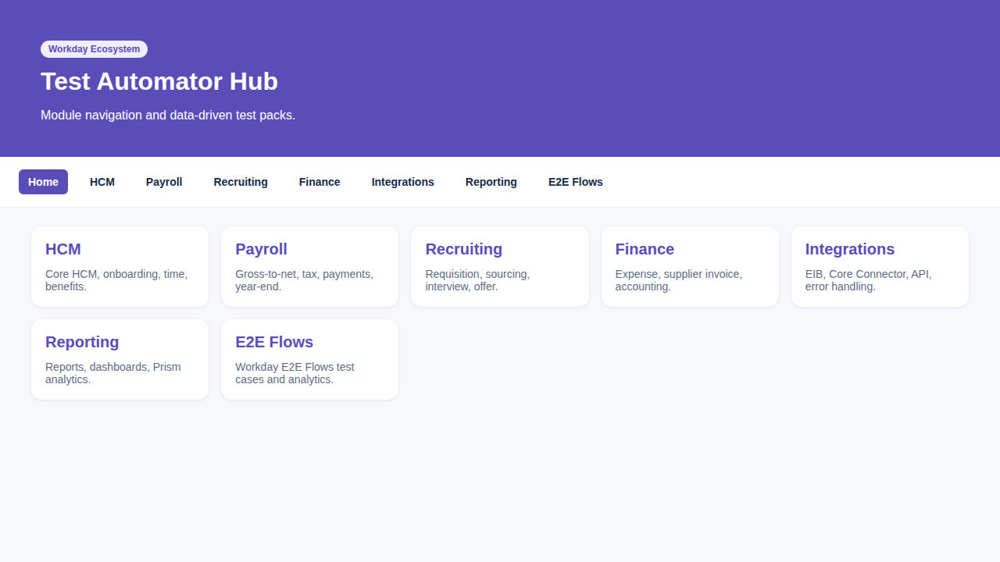
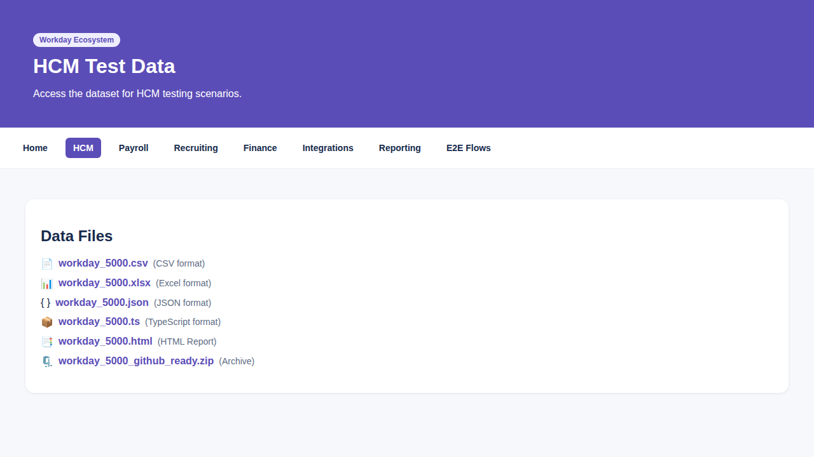

# Workday Test Automator

Workday suite structured for GitHub + Lovable sync. This acts as a standalone static HTML portal for Workday test automation data and analytics.

## Modules

- HCM
- Payroll
- Recruiting
- Finance
- Integrations
- Reporting
- E2E Flows

## Source of Truth

GitHub repo under `/workday` folder. The routing is managed via `manifest.json`.
